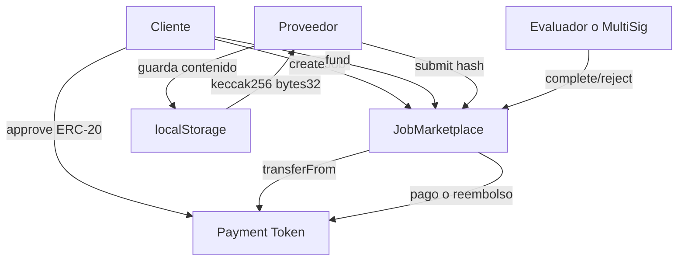
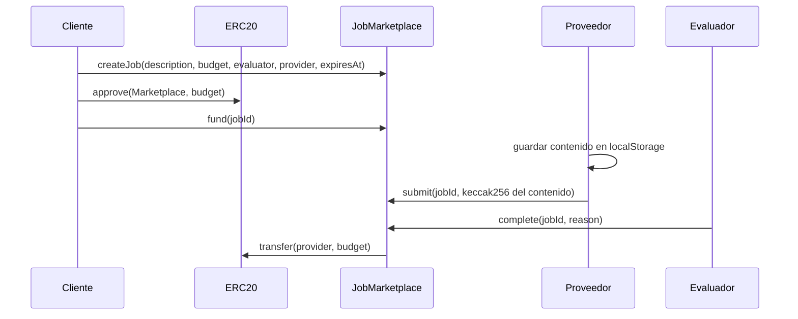
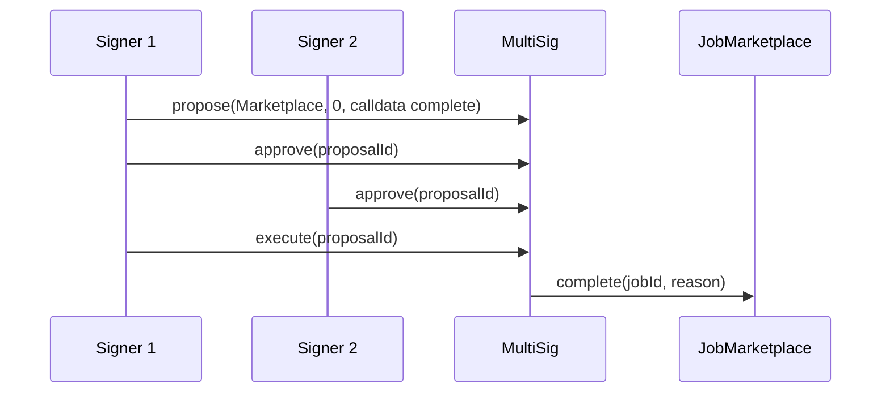

# Entrega Final: Job Marketplace con ERC-20 y MultiSig Evaluator

**Taller 2 - Universidad ORT Uruguay**

[Link al repositorio GitHub](https://github.com/MartinAlonsoo/Entregas_Taller_de_tecnologias_2)

Implementación full-stack de un marketplace de trabajos on-chain con pagos en ERC-20, escrow, evaluador configurable y soporte para usar un contrato MultiSig como evaluador compuesto.

## Resumen ejecutivo

El sistema permite que un cliente publique un trabajo, defina un evaluador, opcionalmente asigne un proveedor, fondee el presupuesto con un token ERC-20, reciba una entrega del proveedor y libere o rechace el pago mediante el evaluador.

El contrato `MultiSig.sol` de Entrega 2 se reutiliza como evaluador. Si un trabajo se crea con `evaluator = VITE_MULTISIG_ADDRESS`, la aprobación final puede hacerse mediante una propuesta MultiSig que llama a `JobMarketplace.complete(jobId, reason)`.

## Stack tecnológico

- Solidity `0.8.4`
- Hardhat `2.6.8`
- wagmi `v2`
- viem `v2`
- RainbowKit `v2`
- TanStack React Query `v5`
- React `19`
- Vite
- TypeScript
- Sepolia Testnet

## Arquitectura general



## Contratos

| Contrato | Rol |
|----------|-----|
| `contracts/JobMarketplace.sol` | Marketplace principal: jobs, escrow ERC-20, estados, entregas, aprobación, rechazo y reembolsos. |
| `contracts/MockERC20.sol` | ERC-20 mínimo para tests, demo local y testnet. No está pensado como token productivo. |
| `contracts/MultiSig.sol` | Contrato de firma múltiple reutilizado desde Entrega 2 como evaluador compuesto. |

## Estados del job

| Estado | Significado |
|--------|-------------|
| `Open` | Trabajo creado, todavía no fondeado. |
| `Funded` | El cliente transfirió el presupuesto al escrow. |
| `Submitted` | El proveedor registró una referencia de entrega. |
| `Completed` | El evaluador aprobó y el pago fue liberado al proveedor. |
| `Rejected` | El trabajo fue rechazado; si estaba fondeado, se reembolsa al cliente. |
| `Expired` | El job venció y se reclamó el reembolso. |

## Flujo principal



## MultiSig como evaluador

Para usar el MultiSig como evaluador:

1. Desplegar `MultiSig.sol` con `npm run deploy:sepolia`.
2. Guardar su dirección en `VITE_MULTISIG_ADDRESS` y `VITE_CONTRACT_ADDRESS`.
3. En el frontend, al publicar un trabajo, usar el botón `Usar MultiSig` en el campo evaluador.
4. El trabajo queda creado con `evaluator = VITE_MULTISIG_ADDRESS`.
5. Cuando el proveedor haga `submit`, abrir el panel `MultiSig evaluator`.
6. Generar calldata para `complete(jobId, reason)` y presionar `Crear propuesta MultiSig`.
7. La aplicación abre la pestaña `Administración MultiSig` con una propuesta precargada:
   - `to = VITE_MARKETPLACE_ADDRESS`
   - `value = 0`
   - `data = calldata generado`
8. Crear la propuesta, aprobarla con los signers hasta alcanzar `threshold` y ejecutarla.
9. Volver al Marketplace y verificar que el job quedó completado y el proveedor recibió el pago.



El helper no firma automáticamente. La pestaña integrada permite revisar y ejecutar
`propose`, `approve` y `execute` usando la misma sesión de wallet.

## Token ERC-20 de pago

`JobMarketplace` usa un único token ERC-20 definido al deploy.

Hay dos opciones:

- Usar un token existente configurando `PAYMENT_TOKEN_ADDRESS`.
- Dejar `PAYMENT_TOKEN_ADDRESS` vacío o como placeholder para que `deployMarketplace.js` despliegue `MockERC20`.

Cuando el script despliega `MockERC20`, también mintea `MOCK_TOKEN_INITIAL_SUPPLY` al deployer para facilitar pruebas de `approve -> fund`.

## Estructura del proyecto

```text
entrega_1_taller_2/
├── contracts/
│   ├── JobMarketplace.sol
│   ├── MockERC20.sol
│   └── MultiSig.sol
├── scripts/
│   ├── deploy.js
│   └── deployMarketplace.js
├── test/
│   ├── JobMarketplace.test.js
│   └── MultiSig.test.js
├── frontend/
│   ├── src/
│   │   ├── abi/
│   │   │   ├── ERC20ABI.ts
│   │   │   ├── JobMarketplaceABI.ts
│   │   │   └── MultiSigABI.ts
│   │   ├── components/
│   │   │   ├── JobBoard.tsx
│   │   │   ├── JobCard.tsx
│   │   │   ├── JobDetail.tsx
│   │   │   ├── JobActionsPanel.tsx
│   │   │   ├── MarketplaceInfo.tsx
│   │   │   ├── MultisigEvaluatorHelper.tsx
│   │   │   ├── PublishJobForm.tsx
│   │   │   └── WalletConnect.tsx
│   │   ├── hooks/
│   │   │   ├── useErc20.ts
│   │   │   ├── useJobActions.ts
│   │   │   ├── useJobs.ts
│   │   │   ├── useMarketplace.ts
│   │   │   ├── useMultisig.ts
│   │   │   └── useJobActions.ts
│   │   ├── App.tsx
│   │   ├── config.ts
│   │   └── index.css
│   └── package.json
├── .env.example
├── hardhat.config.js
├── package.json
└── README.md
```

## Requisitos

- Node.js `^20.19.0` o `>=22.12.0` para Vite 8.
- MetaMask instalado.
- ETH de Sepolia para deploy y gas.
- Dos o más wallets para los signers del MultiSig.
- Un token ERC-20 en Sepolia o uso de `MockERC20`.

Si no tenés ETH de Sepolia, se puede usar un faucet como [Sepolia PoW](https://sepolia-faucet.pk910.de/#/).

## Variables de entorno

Crear `.env` en la raíz desde `.env.example`.

Linux/macOS o Git Bash:

```bash
cp .env.example .env
```

Windows CMD:

```cmd
copy .env.example .env
```

PowerShell:

```powershell
Copy-Item .env.example .env
```

Contenido esperado:

```env
SEPOLIA_RPC_URL=https://ethereum-sepolia-rpc.publicnode.com

PRIVATE_KEY=private_key_Signer1_sin_0x
PRIVATE_KEY_2=private_key_Signer2_sin_0x

VITE_WALLETCONNECT_PROJECT_ID=project_id_de_reown

SIGNERS=AddressSigner1,AddressSigner2
THRESHOLD=2

VITE_MULTISIG_ADDRESS=0xDireccionDelMultiSig
VITE_CONTRACT_ADDRESS=0xDireccionDelMultiSig

PAYMENT_TOKEN_ADDRESS=0xDireccionDelTokenERC20
MOCK_TOKEN_INITIAL_SUPPLY=1000000

VITE_MARKETPLACE_ADDRESS=0xDireccionDelJobMarketplace
VITE_MARKETPLACE_DEPLOYMENT_BLOCK=12345678
VITE_PAYMENT_TOKEN_ADDRESS=0xDireccionDelTokenERC20
```

Notas:

- Las private keys van sin `0x`.
- No subir `.env` a Git.
- Las variables `VITE_` son públicas en el navegador; no poner secretos en ellas.
- `VITE_WALLETCONNECT_PROJECT_ID` se obtiene creando un proyecto público en Reown.
- `VITE_CONTRACT_ADDRESS` se mantiene como alias legacy de `VITE_MULTISIG_ADDRESS`.
- El frontend lee direcciones desde el `.env` de la raíz. No hace falta editar `frontend/src/config.ts`.
- `VITE_MARKETPLACE_DEPLOYMENT_BLOCK` debe ser el bloque exacto donde se
  desplegó `JobMarketplace`; el script de deploy lo imprime.

## Instalación

Desde la raíz:

```bash
npm install
npm run compile
```

Desde `frontend/`:

```bash
npm install
```

## Tests

Desde la raíz:

```bash
npm test
```

La suite cubre:

- flujo completo de `MultiSig`;
- creación, fondeo, entrega y aprobación de jobs;
- rechazos en `Open`, `Funded` y `Submitted`;
- `claimRefund` desde `Funded` y `Submitted`;
- access control;
- integración de `MultiSig` como evaluador ejecutando `complete`.

Última validación local: `42 passing`.

## Deploy en Sepolia

### 1. Deploy MultiSig

Configurar `SIGNERS` y `THRESHOLD` en `.env`.

```bash
npm run deploy:sepolia
```

Copiar la dirección impresa:

```env
VITE_MULTISIG_ADDRESS=0x...
VITE_CONTRACT_ADDRESS=0x...
```

### 2. Deploy Marketplace

Si se quiere usar un token existente:

```env
PAYMENT_TOKEN_ADDRESS=0xTokenERC20Existente
```

Si se quiere usar `MockERC20`, dejar `PAYMENT_TOKEN_ADDRESS` vacío o como placeholder.

```bash
npm run deploy:marketplace:sepolia
```

Copiar la salida:

```env
PAYMENT_TOKEN_ADDRESS=0x...
VITE_MARKETPLACE_ADDRESS=0x...
VITE_MARKETPLACE_DEPLOYMENT_BLOCK=12345678
VITE_PAYMENT_TOKEN_ADDRESS=0x...
```

El script imprime el bloque de deploy, las variables necesarias y calldata de
ejemplo para `complete(0, "approved")`.

## Frontend

Desde `frontend/`:

```bash
npm run dev
```

Abrir la URL local que imprime Vite y conectar MetaMask en Sepolia.

Build de producción:

```bash
npm run build
```

La pantalla principal actual es el Marketplace. Los componentes de Entrega 2 siguen en el repo, pero ya no son la pantalla principal.

El tablero descubre los IDs consultando los eventos históricos `JobCreated`
desde `VITE_MARKETPLACE_DEPLOYMENT_BLOCK`. Después llama a `getJob(jobId)` para
mostrar el estado actual de cada trabajo. De esta forma, los eventos indexan los
jobs y el struct on-chain refleja transiciones posteriores.

## Uso básico de la app

1. Conectar MetaMask en Sepolia.
2. Publicar un job indicando descripción, presupuesto, evaluador, proveedor opcional y vencimiento.
3. Si el evaluador debe ser MultiSig, usar `Usar MultiSig`.
4. Aprobar el token ERC-20 para el Marketplace.
5. Fondear el job.
6. El proveedor escribe el contenido o URL de la entrega. La aplicación lo
   guarda en `localStorage` y registra únicamente su hash en el contrato.
7. El evaluador completa o rechaza.
8. Si el job vence en `Funded` o `Submitted`, cualquiera puede ejecutar `claimRefund`.

## Direcciones Sepolia

Completar después del deploy final.

| Campo | Valor |
|-------|-------|
| Red | Sepolia Testnet |
| Chain ID | `11155111` |
| MultiSig | `0xDireccionDelMultiSig` |
| JobMarketplace | `0xDireccionDelJobMarketplace` |
| PaymentToken | `0xDireccionDelTokenERC20` |
| Etherscan MultiSig | `https://sepolia.etherscan.io/address/0xDireccionDelMultiSig` |
| Etherscan Marketplace | `https://sepolia.etherscan.io/address/0xDireccionDelJobMarketplace` |
| Etherscan Token | `https://sepolia.etherscan.io/address/0xDireccionDelTokenERC20` |

## Decisiones de diseño

- `JobMarketplace` recibe un único token ERC-20 en el constructor.
- `provider` es opcional al crear el job, pero debe estar asignado antes de `fund`.
- `fund` usa `transferFrom`, por lo que el cliente debe hacer `approve` antes.
- `complete` paga al proveedor.
- `reject` en `Open` no mueve fondos; en `Funded` o `Submitted` reembolsa al cliente.
- `claimRefund` es público, sin access control, y depende solo de estado y vencimiento.
- `MultiSig` no se modifica: se reutiliza su capacidad de ejecutar llamadas arbitrarias.
- `MockERC20` es solo para demo/testnet.
- Se mantiene Solidity `0.8.4`, Hardhat `2.6.8` y ethers `v5` para minimizar cambios.
- El frontend conserva y reintegra la administración de Entrega 2 mediante pestañas
  `Marketplace` y `Administración MultiSig`, compartiendo una única sesión de wallet.
- El contenido del entregable se guarda fuera de la blockchain en `localStorage`.
  `deliverableRef` contiene un `keccak256` del registro local, no el contenido.
- El tablero usa `JobCreated` como fuente exclusiva de IDs y `getJob` como
  fuente del estado actualizado.

## RainbowKit / ConnectKit

El frontend reutiliza el stack de Entrega 1:

- `RainbowKit` para conectar, cambiar de red y administrar la cuenta;
- `wagmi` y `viem` para leer y escribir contratos;
- TanStack React Query para caché e invalidación después de cada transacción.

No se usa conexión manual mediante `window.ethereum`, polling periódico ni ethers
en el frontend. Ethers v5 permanece únicamente en Hardhat, scripts y tests.

## Asignación de proveedor

El proveedor puede definirse al publicar el trabajo o dejarse vacío. Si se crea
sin proveedor:

1. el job queda `Open`;
2. el cliente lo selecciona;
3. ingresa una dirección en `Asignar proveedor`;
4. confirma `setProvider`;
5. la query de jobs se invalida y la UI muestra el proveedor sin recargar;
6. recién entonces se habilita el flujo `approve ERC-20 -> fund`.

## Rechazo del cliente en Open

Mientras un trabajo permanece `Open`, el cliente puede ingresar un motivo y
ejecutar `reject`. La acción es irreversible, cambia el trabajo a `Rejected` y
no mueve tokens porque el escrow todavía no fue fondeado.

## Entregables off-chain

Cuando el proveedor envía una entrega:

1. escribe texto libre o una URL, con un máximo de 50.000 bytes;
2. la aplicación guarda un registro local con job, proveedor, contenido y fecha;
3. calcula un `keccak256` de ese registro;
4. guarda inicialmente el registro como `pending`;
5. llama a `submit(jobId, hash)`;
6. después del receipt marca el registro como `confirmed`.

El detalle del trabajo recupera el contenido utilizando el hash on-chain. Si el
registro no existe en el navegador actual, la UI muestra la referencia y avisa
que el contenido no está disponible.

`localStorage` es suficiente para esta entrega, pero no está cifrado ni
sincroniza información entre navegadores o dispositivos. El proveedor y el
evaluador deben usar el mismo navegador y origen para revisar el contenido.

## Limitaciones y supuestos

- `MockERC20` es público y tiene `mint`; usar solo para pruebas o demo.
- `description` se guarda on-chain como `string`.
- `deliverableRef` es un hash `bytes32`; el contenido real permanece en
  `localStorage`.
- `reason` es `bytes32`, por lo que la UI limita el motivo a 31 bytes.
- La UI MultiSig permite crear, aprobar, cancelar y ejecutar propuestas; cada signer
  debe cambiar a su propia cuenta de MetaMask para aportar su aprobación.
- Las direcciones Sepolia deben completarse después del deploy real.

## Integrantes

- Juan Carriquiry (310190)
- Martín Alonso (291799)
