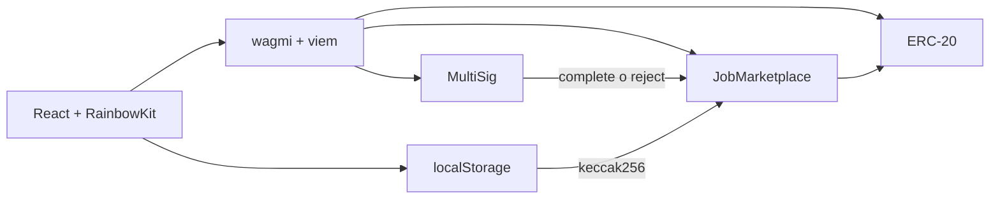
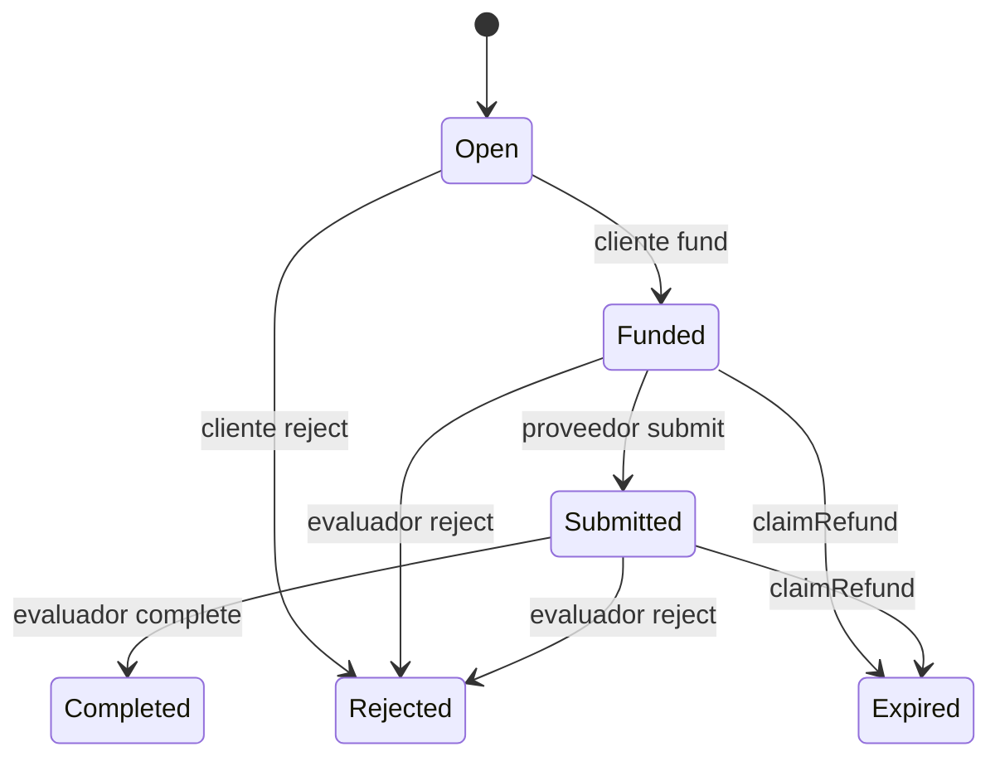

# Entrega Final: Job Marketplace con ERC-20 y MultiSig

**Taller de Tecnologías 2 - Universidad ORT Uruguay**

[Repositorio GitHub](https://github.com/MartinAlonsoo/entrega_1_taller_2)

Aplicación descentralizada para publicar trabajos, bloquear un presupuesto en
un escrow ERC-20, registrar una entrega y liberar o devolver los fondos según
la decisión de un evaluador. El evaluador puede ser una wallet normal o el
contrato MultiSig reutilizado de la Entrega 2.

## Contenido

1. [Qué problema resuelve](#qué-problema-resuelve)
2. [Roles](#roles)
3. [Arquitectura](#arquitectura)
4. [Estados y transiciones](#estados-y-transiciones)
5. [Tecnologías](#tecnologías)
6. [Contratos desplegados](#contratos-desplegados)
7. [Requisitos previos](#requisitos-previos)
8. [Instalación](#instalación)
9. [Variables de entorno](#variables-de-entorno)
10. [Deploy desde cero](#deploy-desde-cero)
11. [Ejecutar y verificar](#ejecutar-y-verificar)
12. [Cómo usar la aplicación](#cómo-usar-la-aplicación)
13. [Flujos disponibles](#flujos-disponibles)
14. [Entregables off-chain](#entregables-off-chain)
15. [Tablero basado en eventos](#tablero-basado-en-eventos)
16. [Tests](#tests)
17. [Decisiones de diseño](#decisiones-de-diseño)
18. [Limitaciones](#limitaciones)
19. [Problemas frecuentes](#problemas-frecuentes)
20. [Estructura del repositorio](#estructura-del-repositorio)

## Qué problema resuelve

Un cliente necesita contratar un trabajo sin pagar por adelantado directamente
al proveedor y sin depender de una autoridad central.

El Marketplace resuelve este problema con un escrow:

1. el cliente publica un trabajo;
2. el cliente deposita el presupuesto en el contrato;
3. el proveedor realiza y registra la entrega;
4. el evaluador acepta o rechaza el resultado;
5. el contrato paga al proveedor o reembolsa al cliente;
6. si el trabajo vence, cualquier cuenta puede activar el reembolso.

Los movimientos económicos se hacen con un único token ERC-20 definido al
desplegar `JobMarketplace`.

## Roles

### Cliente

Wallet que crea y fondea el trabajo.

Necesita:

- ETH de Sepolia para gas;
- tokens ERC-20 para el presupuesto;
- aprobar al Marketplace antes de fondear.

Puede:

- publicar trabajos;
- asignar un proveedor pendiente;
- aprobar y fondear;
- rechazar mientras el trabajo siga `Open`.

### Proveedor

Wallet que realiza el trabajo.

Necesita ETH de Sepolia para registrar la entrega. No necesita tener tokens para
recibir el pago.

Puede:

- registrar la entrega cuando el trabajo está `Funded`;
- recibir el presupuesto cuando el evaluador completa el trabajo.

### Evaluador EOA

Wallet normal configurada como evaluador. Puede rechazar trabajos fondeados y
completar o rechazar trabajos entregados directamente desde `Marketplace`.

### Evaluador MultiSig

Dirección del contrato `MultiSig`. Los signers individuales no son el
evaluador: deben crear, aprobar y ejecutar una propuesta para que la llamada al
Marketplace salga desde el contrato MultiSig.

### Cuenta externa

Wallet sin otro rol. Sirve para demostrar que `claimRefund` puede ejecutarlo
cualquiera después del vencimiento.

## Arquitectura



### Contratos

| Contrato | Responsabilidad |
|---|---|
| `JobMarketplace.sol` | Jobs, roles, estados, escrow, pagos, rechazos y reembolsos. |
| `MockERC20.sol` | Token ERC-20 para tests y demostraciones en testnet. |
| `MultiSig.sol` | Evaluador compuesto con propuestas, aprobaciones y ejecución. |

### Frontend

La aplicación tiene dos pestañas:

| Pestaña | Uso |
|---|---|
| `Marketplace` | Publicar, listar, seleccionar y operar trabajos. |
| `Administración MultiSig` | Crear, aprobar, cancelar y ejecutar propuestas. |

RainbowKit mantiene una sola sesión de wallet compartida por ambas pestañas.

## Estados y transiciones

| Estado | Descripción |
|---|---|
| `Open` | Trabajo publicado, todavía no fondeado. |
| `Funded` | Presupuesto bloqueado en el Marketplace. |
| `Submitted` | Proveedor registró el hash de la entrega. |
| `Completed` | Evaluador aprobó y el proveedor recibió el pago. |
| `Rejected` | Trabajo rechazado; si estaba fondeado se reembolsó al cliente. |
| `Expired` | Trabajo vencido y reembolsado. |



## Tecnologías

### Blockchain

- Solidity `0.8.4`
- Hardhat `2.6.8`
- ethers `v5` en Hardhat, tests y scripts
- Sepolia Testnet

### Frontend

- React `19`
- TypeScript `6`
- Vite `8`
- RainbowKit `2`
- wagmi `2`
- viem `2`
- TanStack React Query `5`

El frontend no usa `window.ethereum`, ethers ni polling manual. RainbowKit
administra la conexión; wagmi y viem operan los contratos; React Query actualiza
el estado mediante invalidaciones después de cada receipt.

## Contratos desplegados

Despliegue de referencia utilizado para la validación manual:

| Elemento | Valor |
|---|---|
| Red | Sepolia |
| Chain ID | `11155111` |
| MultiSig | `0x19f1e8BC9a50E84aC13938dEC80F431dA7b532A9` |
| JobMarketplace | `0xb179992292DF089D04421C5A951bd9348228A0F2` |
| PaymentToken | `0x60c3E48CA772938e065dB710E9fa7e61CC3C165b` |
| Bloque de deploy Marketplace | `11133247` |
| Token | `Mock USD (MUSD)`, 18 decimales |

Enlaces:

- [MultiSig en Etherscan](https://sepolia.etherscan.io/address/0x19f1e8BC9a50E84aC13938dEC80F431dA7b532A9)
- [JobMarketplace en Etherscan](https://sepolia.etherscan.io/address/0xb179992292DF089D04421C5A951bd9348228A0F2)
- [MockERC20 en Etherscan](https://sepolia.etherscan.io/address/0x60c3E48CA772938e065dB710E9fa7e61CC3C165b)

El token es un mock desplegado en Sepolia. Se comporta como ERC-20, pero no
tiene valor económico real.

### Ver el token en MetaMask

Importar el token manualmente:

```text
Dirección: 0x60c3E48CA772938e065dB710E9fa7e61CC3C165b
Símbolo: MUSD
Decimales: 18
```

Los pagos al proveedor se observan en:

- la wallet del proveedor;
- `Token Transfers` de la dirección del proveedor;
- `Token Transfers` del Marketplace;
- los eventos `Transfer` emitidos por `MockERC20`.

No deben buscarse en `Token Transfers` del MultiSig: el MultiSig ejecuta la
llamada, pero los tokens se transfieren desde el Marketplace al proveedor.

## Requisitos previos

- Node.js `^20.19.0` o `>=22.12.0`.
- npm.
- MetaMask.
- ETH de Sepolia para las cuentas que envían transacciones.
- Un proyecto de Reown para WalletConnect.
- Dos wallets signer si el threshold del MultiSig es `2`.

RainbowKit requiere un `projectId` de WalletConnect. Puede obtenerse
gratuitamente desde el [Dashboard de Reown](https://dashboard.reown.com/).

## Instalación

Desde la raíz:

```bash
npm install
npm run compile
npm test
```

Desde `frontend/`:

```bash
cd frontend
npm install
npm run build
cd ..
```

Resultado de referencia:

```text
Nothing to compile
42 passing
```

## Variables de entorno

El repositorio usa **un único `.env` en la raíz**. Vite lo lee mediante
`envDir: "../"`.

Crear el archivo:

Linux, macOS o Git Bash:

```bash
cp .env.example .env
```

PowerShell:

```powershell
Copy-Item .env.example .env
```

Windows CMD:

```cmd
copy .env.example .env
```

### Referencia completa

| Variable | Para qué sirve | Cómo obtenerla |
|---|---|---|
| `SEPOLIA_RPC_URL` | RPC usado por Hardhat para deploy. | Endpoint público o proveedor RPC propio. |
| `VITE_SEPOLIA_RPC_URL` | RPC opcional usado por el frontend. | Si falta, se usa el fallback definido en `frontend/src/config.ts`. |
| `PRIVATE_KEY` | Cuenta deployer usada por Hardhat. | Exportar una cuenta de prueba de MetaMask, sin prefijo `0x`. |
| `PRIVATE_KEY_2` | Variable legacy/reservada. | El `hardhat.config.js` actual no la consume. Los demás signers operan desde MetaMask. |
| `SIGNERS` | Direcciones autorizadas en el MultiSig. | Copiar las direcciones públicas de las wallets signer, separadas por coma. |
| `THRESHOLD` | Cantidad de aprobaciones necesarias. | Elegir un entero entre `1` y la cantidad de signers. |
| `VITE_WALLETCONNECT_PROJECT_ID` | Identifica la dApp ante WalletConnect. | Crear un proyecto en el Dashboard de Reown y copiar su Project ID. |
| `VITE_MULTISIG_ADDRESS` | Dirección que consume el frontend. | Salida de `npm run deploy:sepolia`. |
| `VITE_CONTRACT_ADDRESS` | Alias legacy del MultiSig. | Usar el mismo valor que `VITE_MULTISIG_ADDRESS`. |
| `PAYMENT_TOKEN_ADDRESS` | Token que recibe el constructor del Marketplace. | Usar un ERC-20 existente o dejar vacío para desplegar `MockERC20`. |
| `MOCK_TOKEN_INITIAL_SUPPLY` | Mint inicial del mock para el deployer. | Cantidad en unidades legibles; por defecto `1000000`. |
| `VITE_MARKETPLACE_ADDRESS` | Marketplace que consume el frontend. | Salida de `npm run deploy:marketplace:sepolia`. |
| `VITE_MARKETPLACE_DEPLOYMENT_BLOCK` | Inicio de la búsqueda de `JobCreated`. | Bloque impreso por el script de deploy del Marketplace. |
| `VITE_PAYMENT_TOKEN_ADDRESS` | Token que consulta el frontend. | Dirección final del token impresa por el deploy. |

### Usar el despliegue actual

Para ejecutar el frontend contra los contratos ya desplegados, completar el
Project ID propio de Reown y utilizar estas variables públicas:

```env
VITE_WALLETCONNECT_PROJECT_ID=tu_project_id_de_reown

VITE_MULTISIG_ADDRESS=0x19f1e8BC9a50E84aC13938dEC80F431dA7b532A9
VITE_CONTRACT_ADDRESS=0x19f1e8BC9a50E84aC13938dEC80F431dA7b532A9

PAYMENT_TOKEN_ADDRESS=0x60c3E48CA772938e065dB710E9fa7e61CC3C165b
VITE_PAYMENT_TOKEN_ADDRESS=0x60c3E48CA772938e065dB710E9fa7e61CC3C165b

VITE_MARKETPLACE_ADDRESS=0xb179992292DF089D04421C5A951bd9348228A0F2
VITE_MARKETPLACE_DEPLOYMENT_BLOCK=11133247
```

`PRIVATE_KEY`, `SIGNERS` y `THRESHOLD` solo son necesarios para volver a
desplegar. El frontend opera con las cuentas conectadas mediante RainbowKit.

### Seguridad

- Nunca versionar `.env`.
- Usar únicamente cuentas de prueba.
- Las variables `VITE_` son públicas en el navegador.
- No colocar claves privadas en variables `VITE_`.
- `SIGNERS` contiene direcciones públicas, no claves privadas.
- Para un entorno real se recomienda un RPC dedicado y restringir el Project ID
  de Reown mediante allowlist.

## Deploy desde cero

### 1. Preparar el `.env` inicial

Antes del deploy:

```env
SEPOLIA_RPC_URL=https://ethereum-sepolia-rpc.publicnode.com

PRIVATE_KEY=clave_deployer_sin_0x

VITE_WALLETCONNECT_PROJECT_ID=project_id_de_reown

SIGNERS=0xSigner1,0xSigner2
THRESHOLD=2

# Vacío significa: desplegar MockERC20.
PAYMENT_TOKEN_ADDRESS=
MOCK_TOKEN_INITIAL_SUPPLY=1000000
```

### 2. Desplegar MultiSig

```bash
npm run deploy:sepolia
```

Copiar la dirección impresa:

```env
VITE_MULTISIG_ADDRESS=0xDireccionImprimida
VITE_CONTRACT_ADDRESS=0xDireccionImprimida
```

Ambas variables deben ser iguales.

### 3. Elegir token

#### Usar MockERC20

Dejar:

```env
PAYMENT_TOKEN_ADDRESS=
```

El script:

1. despliega `MockERC20`;
2. mintea `MOCK_TOKEN_INITIAL_SUPPLY` al deployer;
3. despliega el Marketplace con ese token.

#### Usar un ERC-20 existente

Configurar:

```env
PAYMENT_TOKEN_ADDRESS=0xDireccionTokenExistente
```

La cuenta cliente debe conseguir ese token por separado.

### 4. Desplegar Marketplace

```bash
npm run deploy:marketplace:sepolia
```

Copiar la salida:

```env
PAYMENT_TOKEN_ADDRESS=0x...
VITE_MARKETPLACE_ADDRESS=0x...
VITE_MARKETPLACE_DEPLOYMENT_BLOCK=12345678
VITE_PAYMENT_TOKEN_ADDRESS=0x...
```

El bloque debe ser exactamente el bloque de despliegue de `JobMarketplace`.
No usar el bloque del token ni el del MultiSig.

### 5. Revisar el `.env` final

```env
VITE_WALLETCONNECT_PROJECT_ID=...

VITE_MULTISIG_ADDRESS=0x...
VITE_CONTRACT_ADDRESS=0x...

PAYMENT_TOKEN_ADDRESS=0x...
VITE_PAYMENT_TOKEN_ADDRESS=0x...

VITE_MARKETPLACE_ADDRESS=0x...
VITE_MARKETPLACE_DEPLOYMENT_BLOCK=...
```

Reiniciar Vite siempre que cambie el `.env`.

## Ejecutar y verificar

### Contratos

Desde la raíz:

```bash
npm run compile
npm test
```

### Frontend en desarrollo

En otra terminal:

```bash
cd frontend
npm run dev
```

Abrir la URL mostrada por Vite, normalmente:

```text
http://localhost:5173
```

No alternar entre `localhost` y `127.0.0.1` durante las pruebas del
deliverable: `localStorage` depende del origen.

### Build

```bash
cd frontend
npm run build
```

## Cómo usar la aplicación

### Conectar wallet

1. Abrir la aplicación.
2. Presionar `Conectar Wallet`.
3. Elegir MetaMask en RainbowKit.
4. Autorizar la conexión.
5. Si aparece `Red incorrecta`, presionarlo y elegir Sepolia.

### Cambiar de wallet

1. Presionar la cuenta abreviada arriba a la derecha.
2. Cambiar la cuenta en MetaMask.
3. Si RainbowKit no refleja el cambio, desconectar y volver a conectar.
4. Confirmar la dirección antes de ejecutar la acción.

Los roles y permisos se recalculan sin recargar.

### Navegar

```text
Marketplace | Administración MultiSig
```

`Marketplace` contiene:

- formulario `Publicar trabajo`;
- tablero `Trabajos publicados`;
- detalle del job seleccionado;
- acciones por rol;
- helper `MultiSig evaluator`.

`Administración MultiSig` contiene:

- formulario de propuesta;
- propuestas pendientes, ejecutadas y canceladas;
- acciones `Aprobar`, `Ejecutar` y `Cancelar`;
- signers y threshold.

## Flujos disponibles

La guía exhaustiva con datos, evidencia y checklist está en:

[Guía de uso y validación manual](./guia_validacion_manual_entrega_3.md)

### Happy path con MultiSig

Datos sugeridos:

| Campo | Valor |
|---|---|
| Descripción | `QA-MULTISIG-HAPPY-001` |
| Presupuesto | `10` |
| Evaluador | botón `Usar MultiSig` |
| Proveedor | wallet del proveedor |
| Vencimiento | al menos 24 horas en el futuro |
| Entrega | `Entrega QA v1 - https://example.com/entrega` |
| Razón | `approved` |

#### Cliente

1. Conectar la wallet cliente.
2. Permanecer en `Marketplace`.
3. Completar `Publicar trabajo`.
4. Presionar `Usar MultiSig`.
5. Publicar y seleccionar el job.
6. Presionar `Aprobar token`.
7. Después del receipt, presionar `Fondear escrow`.

El job pasa:

```text
Open -> Funded
```

#### Proveedor

1. Cambiar a la wallet proveedor.
2. Seleccionar el mismo job.
3. Escribir el contenido o URL.
4. Presionar `Registrar entrega`.

El job pasa:

```text
Funded -> Submitted
```

#### Signer 1

1. Cambiar a `SIGNER_1`.
2. Seleccionar el job entregado.
3. En `MultiSig evaluator`, revisar `jobId`.
4. Escribir `approved`.
5. Presionar `Crear propuesta MultiSig`.
6. Revisar destino, valor `0` y calldata.
7. Presionar `Enviar Propuesta`.
8. Aprobar la propuesta.

Crear una propuesta no la aprueba automáticamente.

#### Signer 2

1. Cambiar a `SIGNER_2`.
2. Permanecer en `Administración MultiSig`.
3. Confirmar la etiqueta `Signer`.
4. Aprobar la misma propuesta.
5. Cuando se alcance el threshold, presionar `Ejecutar`.
6. Volver al Marketplace.

Resultado:

```text
Submitted -> Completed
Marketplace -> proveedor: transferencia del presupuesto
```

### Proveedor asignado después

1. Publicar el job dejando `Proveedor opcional` vacío.
2. Seleccionarlo como cliente.
3. Pegar una dirección en `Dirección del proveedor`.
4. Presionar `Asignar proveedor`.
5. Después del receipt aparece `Aprobar token`.

Solo el cliente puede ejecutar `setProvider`, el job debe estar `Open` y el
proveedor solo puede asignarse una vez.

### Rechazo del cliente en Open

1. Crear un job.
2. No fondearlo.
3. Seleccionarlo como cliente.
4. Escribir `cancelled`.
5. Presionar `Rechazar trabajo`.

Resultado:

```text
Open -> Rejected
```

No se mueven tokens porque el escrow todavía está vacío.

### Rechazo del evaluador en Funded

1. Crear y fondear un job con evaluador EOA.
2. Cambiar a la wallet evaluadora.
3. Escribir `rejected`.
4. Presionar `Rechazar`.

Resultado:

```text
Funded -> Rejected
Marketplace -> cliente: reembolso
```

### Rechazo del evaluador en Submitted

1. Crear, fondear y entregar un job.
2. Cambiar al evaluador.
3. Presionar `Rechazar`.

Resultado:

```text
Submitted -> Rejected
Marketplace -> cliente: reembolso
```

La referencia de entrega permanece registrada.

### Complete con evaluador EOA

1. Publicar usando la dirección de una wallet como evaluador.
2. Fondear como cliente.
3. Entregar como proveedor.
4. Cambiar al evaluador.
5. Escribir `approved`.
6. Presionar `Completar y pagar`.

Resultado:

```text
Submitted -> Completed
Marketplace -> proveedor: pago
```

### Refund desde Funded

1. Crear un job con vencimiento corto.
2. Fondearlo.
3. Esperar hasta que `block.timestamp > expiresAt`.
4. Conectar cualquier wallet.
5. Presionar `Reclamar reembolso`.

Resultado:

```text
Funded -> Expired
Marketplace -> cliente: reembolso
```

### Refund desde Submitted

1. Crear un job con vencimiento corto.
2. Fondear y registrar entrega.
3. Esperar el vencimiento.
4. Ejecutar `Reclamar reembolso` desde cualquier wallet.

Resultado:

```text
Submitted -> Expired
Marketplace -> cliente: reembolso
```

## Entregables off-chain

El contrato guarda solamente `deliverableRef: bytes32`.

El frontend:

1. recibe texto o una URL;
2. crea un registro con job, proveedor, contenido y fecha;
3. calcula un `keccak256`;
4. guarda el contenido en `localStorage`;
5. envía únicamente el hash mediante `submit`;
6. marca el registro local como confirmado después del receipt.

Limitaciones:

- funciona únicamente en el mismo navegador y origen;
- no sincroniza dispositivos;
- no cifra el contenido;
- no reemplaza IPFS ni un backend;
- admite hasta 50.000 bytes.

Cambiar de wallet en el mismo navegador no elimina el contenido. Abrir el job en
otro navegador muestra el hash on-chain y una advertencia de contenido local no
disponible.

## Tablero basado en eventos

La letra exige descubrir trabajos mediante `JobCreated`.

El frontend ejecuta:

```text
getContractEvents(JobCreated, deploymentBlock, latest)
-> extraer y deduplicar jobId
-> getJob(jobId)
-> mostrar estado actual
```

`JobCreated` descubre los IDs. `getJob` obtiene el estado mutable actual porque
el evento solo representa el momento de creación.

`VITE_MARKETPLACE_DEPLOYMENT_BLOCK` evita escanear Sepolia desde génesis y debe
coincidir con el bloque real del Marketplace.

## Tests

Ejecutar:

```bash
npm test
```

La suite cubre:

- deploy y operaciones del MultiSig;
- creación y campos del job;
- happy path completo;
- rechazo del cliente en `Open`;
- rechazo del evaluador en `Funded`;
- rechazo del evaluador en `Submitted`;
- refund desde `Funded`;
- refund desde `Submitted`;
- access control por función y estado;
- MultiSig real ejecutando `complete`.

Último resultado validado:

```text
42 passing
```

## Decisiones de diseño

- El Marketplace usa un único ERC-20 inmutable.
- El proveedor es opcional al crear, pero obligatorio antes de fondear.
- `fund` usa `transferFrom`; por eso requiere `approve`.
- El Marketplace mantiene el presupuesto en escrow.
- `complete` paga al proveedor.
- `reject` en `Open` no mueve fondos.
- `reject` en `Funded` o `Submitted` reembolsa al cliente.
- `claimRefund` es público y no depende del rol del caller.
- Las funciones que mueven fondos están protegidas contra reentrancy.
- `MultiSig.sol` se reutiliza sin modificar su modelo de propuestas.
- RainbowKit, wagmi, viem y React Query reutilizan el enfoque de Entrega 1.
- La administración MultiSig reutiliza componentes de Entrega 2.
- Los IDs del tablero provienen exclusivamente de `JobCreated`.
- El contenido del entregable permanece off-chain.
- `MockERC20` solo se usa para test o demostración.

## Limitaciones

- `MockERC20.mint` es público. El token no representa dinero real y no debe
  usarse en producción.
- El contenido de las entregas está limitado al navegador y origen que conserva
  `localStorage`.
- Los motivos `reason` se almacenan en `bytes32` y la UI los limita a 31 bytes.
- Las direcciones documentadas corresponden a contratos de prueba en Sepolia.
- Los contratos no fueron presentados como auditados para producción.
- El RPC público puede aplicar límites o sufrir demoras de indexación.

## Problemas frecuentes

### La aplicación no inicia

Comprobar:

- `VITE_WALLETCONNECT_PROJECT_ID`;
- `VITE_MULTISIG_ADDRESS`;
- `VITE_MARKETPLACE_ADDRESS`;
- `VITE_MARKETPLACE_DEPLOYMENT_BLOCK`;
- `VITE_PAYMENT_TOKEN_ADDRESS`;
- reinicio de Vite después de modificar `.env`.

### No aparecen trabajos

Comprobar:

1. red Sepolia;
2. dirección del Marketplace;
3. bloque de deploy;
4. eventos `JobCreated` en Etherscan;
5. RPC del frontend.

### La pestaña MultiSig dice `No signer`

La wallet conectada no pertenece al array de signers del contrato desplegado.

### Un signer no puede completar directamente

Es correcto. El evaluator es el contrato MultiSig:

```text
Marketplace
-> MultiSig evaluator
-> Crear propuesta MultiSig
-> Administración MultiSig
-> Aprobar hasta threshold
-> Ejecutar
```

### No aparece Aprobar token

Posibles causas:

- la wallet no es el cliente;
- falta proveedor;
- el job no está `Open`;
- el allowance ya es suficiente y aparece `Fondear escrow`.

### No veo el pago en Etherscan

No buscarlo en `Token Transfers` del MultiSig.

Revisar:

- transacción de ejecución;
- logs `Transfer` del token;
- `Token Transfers` del Marketplace;
- `Token Transfers` de la wallet proveedor;
- token importado en MetaMask.

### El proveedor no puede registrar entrega

Comprobar:

- wallet conectada igual a `job.provider`;
- estado `Funded`;
- job no vencido;
- ETH Sepolia disponible.

### El contenido no aparece en otro navegador

Es el comportamiento esperado de `localStorage`. El hash permanece on-chain,
pero el contenido completo no se sincroniza.

### La propuesta MultiSig revierte

Comprobar:

1. job `Submitted`;
2. evaluator igual al MultiSig;
3. destino igual al Marketplace;
4. value igual a `0`;
5. calldata correspondiente al job correcto;
6. threshold alcanzado;
7. propuesta pendiente.

## Estructura del repositorio

```text
.
├── contracts/
│   ├── JobMarketplace.sol
│   ├── MockERC20.sol
│   └── MultiSig.sol
├── scripts/
│   ├── deploy.js
│   └── deployMarketplace.js
├── test/
│   ├── JobMarketplace.test.js
│   └── MultiSig.test.js
├── frontend/
│   ├── src/
│   │   ├── abi/
│   │   ├── components/
│   │   ├── config/
│   │   ├── hooks/
│   │   ├── lib/
│   │   ├── types/
│   │   ├── utils/
│   │   ├── App.tsx
│   │   └── main.tsx
│   └── package.json
├── .env.example
├── guia_validacion_manual_entrega_3.md
├── hardhat.config.js
├── package.json
└── README.md
```

## Documentación relacionada

- [Guía completa de uso y validación](./guia_validacion_manual_entrega_3.md)
- [Instalación oficial de RainbowKit](https://rainbowkit.com/docs/installation)
- [Dashboard de Reown](https://dashboard.reown.com/)

## Integrantes

- Juan Carriquiry - 310190
- Martín Alonso - 291799
