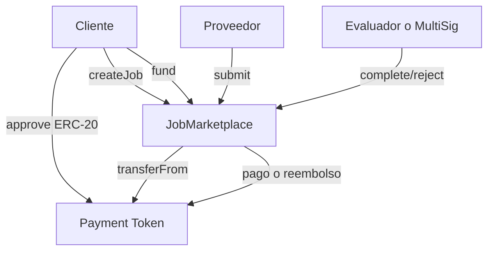
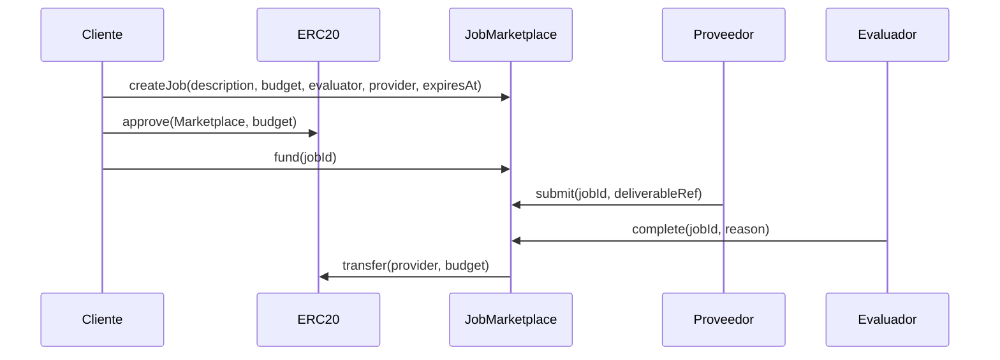
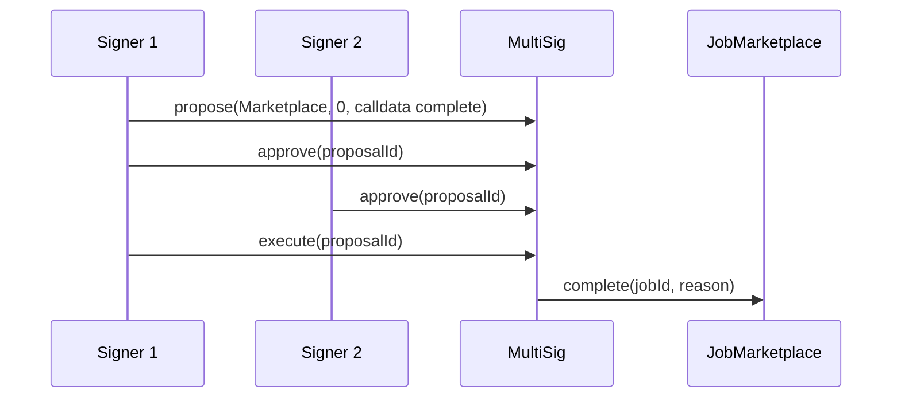

# Entrega Final: Job Marketplace con ERC-20 y MultiSig Evaluator

**Taller 2 - Universidad ORT Uruguay**

[Link al repositorio GitHub](https://github.com/MartinAlonsoo/Entregas_Taller_de_tecnologias_2)

Implementación full-stack de un marketplace de trabajos on-chain con pagos en ERC-20, escrow, evaluador configurable y soporte para usar un contrato MultiSig como evaluador compuesto.

## Resumen ejecutivo

El sistema permite que un cliente publique un trabajo, defina un evaluador, opcionalmente asigne un proveedor, fondee el presupuesto con un token ERC-20, reciba una entrega del proveedor y libere o rechace el pago mediante el evaluador.

El contrato `MultiSig.sol` de Entrega 2 se reutiliza como evaluador. Si un trabajo se crea con `evaluator = VITE_MULTISIG_ADDRESS`, la aprobación final puede hacerse mediante una propuesta MultiSig que llama a `JobMarketplace.complete(jobId, reason)`.

## Stack tecnológico

- Solidity `0.8.4`
- Hardhat `2.6.8`
- ethers `v5`
- React `18`
- Vite
- TypeScript
- MetaMask
- Sepolia Testnet

## Arquitectura general



## Contratos

| Contrato | Rol |
|----------|-----|
| `contracts/JobMarketplace.sol` | Marketplace principal: jobs, escrow ERC-20, estados, entregas, aprobación, rechazo y reembolsos. |
| `contracts/MockERC20.sol` | ERC-20 mínimo para tests, demo local y testnet. No está pensado como token productivo. |
| `contracts/MultiSig.sol` | Contrato de firma múltiple reutilizado desde Entrega 2 como evaluador compuesto. |

## Estados del job

| Estado | Significado |
|--------|-------------|
| `Open` | Trabajo creado, todavía no fondeado. |
| `Funded` | El cliente transfirió el presupuesto al escrow. |
| `Submitted` | El proveedor registró una referencia de entrega. |
| `Completed` | El evaluador aprobó y el pago fue liberado al proveedor. |
| `Rejected` | El trabajo fue rechazado; si estaba fondeado, se reembolsa al cliente. |
| `Expired` | El job venció y se reclamó el reembolso. |

## Flujo principal



## MultiSig como evaluador

Para usar el MultiSig como evaluador:

1. Desplegar `MultiSig.sol` con `npm run deploy:sepolia`.
2. Guardar su dirección en `VITE_MULTISIG_ADDRESS` y `VITE_CONTRACT_ADDRESS`.
3. En el frontend, al publicar un trabajo, usar el botón `Usar MultiSig` en el campo evaluador.
4. El trabajo queda creado con `evaluator = VITE_MULTISIG_ADDRESS`.
5. Cuando el proveedor haga `submit`, abrir el panel `MultiSig evaluator`.
6. Generar calldata para `complete(jobId, reason)`.
7. En una UI/flujo MultiSig, crear una propuesta con:
   - `to = VITE_MARKETPLACE_ADDRESS`
   - `value = 0`
   - `data = calldata generado`
8. Aprobar hasta alcanzar `threshold`.
9. Ejecutar la propuesta.



El helper del frontend genera calldata, pero no ejecuta `propose`, `approve` ni `execute`.

## Token ERC-20 de pago

`JobMarketplace` usa un único token ERC-20 definido al deploy.

Hay dos opciones:

- Usar un token existente configurando `PAYMENT_TOKEN_ADDRESS`.
- Dejar `PAYMENT_TOKEN_ADDRESS` vacío o como placeholder para que `deployMarketplace.js` despliegue `MockERC20`.

Cuando el script despliega `MockERC20`, también mintea `MOCK_TOKEN_INITIAL_SUPPLY` al deployer para facilitar pruebas de `approve -> fund`.

## Estructura del proyecto

```text
entrega_1_taller_2/
├── contracts/
│   ├── JobMarketplace.sol
│   ├── MockERC20.sol
│   └── MultiSig.sol
├── scripts/
│   ├── deploy.js
│   └── deployMarketplace.js
├── test/
│   ├── JobMarketplace.test.js
│   └── MultiSig.test.js
├── frontend/
│   ├── src/
│   │   ├── abi/
│   │   │   ├── ERC20ABI.ts
│   │   │   ├── JobMarketplaceABI.ts
│   │   │   └── MultiSigABI.ts
│   │   ├── components/
│   │   │   ├── JobBoard.tsx
│   │   │   ├── JobCard.tsx
│   │   │   ├── JobDetail.tsx
│   │   │   ├── JobActionsPanel.tsx
│   │   │   ├── MarketplaceInfo.tsx
│   │   │   ├── MultisigEvaluatorHelper.tsx
│   │   │   ├── PublishJobForm.tsx
│   │   │   └── WalletConnect.tsx
│   │   ├── hooks/
│   │   │   ├── useErc20.ts
│   │   │   ├── useJobActions.ts
│   │   │   ├── useJobs.ts
│   │   │   ├── useMarketplace.ts
│   │   │   ├── useMultisig.ts
│   │   │   └── useWallet.ts
│   │   ├── App.tsx
│   │   ├── config.ts
│   │   └── index.css
│   └── package.json
├── .env.example
├── hardhat.config.js
├── package.json
└── README.md
```

## Requisitos

- Node.js compatible con Hardhat/Vite.
- MetaMask instalado.
- ETH de Sepolia para deploy y gas.
- Dos o más wallets para los signers del MultiSig.
- Un token ERC-20 en Sepolia o uso de `MockERC20`.

Si no tenés ETH de Sepolia, se puede usar un faucet como [Sepolia PoW](https://sepolia-faucet.pk910.de/#/).

## Variables de entorno

Crear `.env` en la raíz desde `.env.example`.

Linux/macOS o Git Bash:

```bash
cp .env.example .env
```

Windows CMD:

```cmd
copy .env.example .env
```

PowerShell:

```powershell
Copy-Item .env.example .env
```

Contenido esperado:

```env
SEPOLIA_RPC_URL=https://ethereum-sepolia-rpc.publicnode.com

PRIVATE_KEY=private_key_Signer1_sin_0x
PRIVATE_KEY_2=private_key_Signer2_sin_0x

SIGNERS=AddressSigner1,AddressSigner2
THRESHOLD=2

VITE_MULTISIG_ADDRESS=0xDireccionDelMultiSig
VITE_CONTRACT_ADDRESS=0xDireccionDelMultiSig

PAYMENT_TOKEN_ADDRESS=0xDireccionDelTokenERC20
MOCK_TOKEN_INITIAL_SUPPLY=1000000

VITE_MARKETPLACE_ADDRESS=0xDireccionDelJobMarketplace
VITE_PAYMENT_TOKEN_ADDRESS=0xDireccionDelTokenERC20
```

Notas:

- Las private keys van sin `0x`.
- No subir `.env` a Git.
- Las variables `VITE_` son públicas en el navegador; no poner secretos en ellas.
- `VITE_CONTRACT_ADDRESS` se mantiene como alias legacy de `VITE_MULTISIG_ADDRESS`.
- El frontend lee direcciones desde el `.env` de la raíz. No hace falta editar `frontend/src/config.ts`.

## Instalación

Desde la raíz:

```bash
npm install
npm run compile
```

Desde `frontend/`:

```bash
npm install
```

## Tests

Desde la raíz:

```bash
npm test
```

La suite cubre:

- flujo completo de `MultiSig`;
- creación, fondeo, entrega y aprobación de jobs;
- rechazos en `Open`, `Funded` y `Submitted`;
- `claimRefund` desde `Funded` y `Submitted`;
- access control;
- integración de `MultiSig` como evaluador ejecutando `complete`.

Última validación local: `42 passing`.

## Deploy en Sepolia

### 1. Deploy MultiSig

Configurar `SIGNERS` y `THRESHOLD` en `.env`.

```bash
npm run deploy:sepolia
```

Copiar la dirección impresa:

```env
VITE_MULTISIG_ADDRESS=0x...
VITE_CONTRACT_ADDRESS=0x...
```

### 2. Deploy Marketplace

Si se quiere usar un token existente:

```env
PAYMENT_TOKEN_ADDRESS=0xTokenERC20Existente
```

Si se quiere usar `MockERC20`, dejar `PAYMENT_TOKEN_ADDRESS` vacío o como placeholder.

```bash
npm run deploy:marketplace:sepolia
```

Copiar la salida:

```env
PAYMENT_TOKEN_ADDRESS=0x...
VITE_MARKETPLACE_ADDRESS=0x...
VITE_PAYMENT_TOKEN_ADDRESS=0x...
```

El script también imprime calldata de ejemplo para `complete(0, "approved")`.

## Frontend

Desde `frontend/`:

```bash
npm run dev
```

Abrir la URL local que imprime Vite y conectar MetaMask en Sepolia.

Build de producción:

```bash
npm run build
```

La pantalla principal actual es el Marketplace. Los componentes de Entrega 2 siguen en el repo, pero ya no son la pantalla principal.

## Uso básico de la app

1. Conectar MetaMask en Sepolia.
2. Publicar un job indicando descripción, presupuesto, evaluador, proveedor opcional y vencimiento.
3. Si el evaluador debe ser MultiSig, usar `Usar MultiSig`.
4. Aprobar el token ERC-20 para el Marketplace.
5. Fondear el job.
6. El proveedor registra una entrega.
7. El evaluador completa o rechaza.
8. Si el job vence en `Funded` o `Submitted`, cualquiera puede ejecutar `claimRefund`.

## Direcciones Sepolia

Completar después del deploy final.

| Campo | Valor |
|-------|-------|
| Red | Sepolia Testnet |
| Chain ID | `11155111` |
| MultiSig | `0xDireccionDelMultiSig` |
| JobMarketplace | `0xDireccionDelJobMarketplace` |
| PaymentToken | `0xDireccionDelTokenERC20` |
| Etherscan MultiSig | `https://sepolia.etherscan.io/address/0xDireccionDelMultiSig` |
| Etherscan Marketplace | `https://sepolia.etherscan.io/address/0xDireccionDelJobMarketplace` |
| Etherscan Token | `https://sepolia.etherscan.io/address/0xDireccionDelTokenERC20` |

## Decisiones de diseño

- `JobMarketplace` recibe un único token ERC-20 en el constructor.
- `provider` es opcional al crear el job, pero debe estar asignado antes de `fund`.
- `fund` usa `transferFrom`, por lo que el cliente debe hacer `approve` antes.
- `complete` paga al proveedor.
- `reject` en `Open` no mueve fondos; en `Funded` o `Submitted` reembolsa al cliente.
- `claimRefund` es público, sin access control, y depende solo de estado y vencimiento.
- `MultiSig` no se modifica: se reutiliza su capacidad de ejecutar llamadas arbitrarias.
- `MockERC20` es solo para demo/testnet.
- Se mantiene Solidity `0.8.4`, Hardhat `2.6.8` y ethers `v5` para minimizar cambios.
- El frontend conserva código de Entrega 2, pero la pantalla principal es Marketplace.

## RainbowKit / ConnectKit

La letra de Entrega 3 pide usar RainbowKit o ConnectKit. La decisión de diseño del proyecto es reintroducir **RainbowKit + wagmi**, porque coincide mejor con la base de Entrega 1 y con el stack esperado por la letra.

Estado actual del código:

- El frontend actual todavía conecta wallet con `window.ethereum` y `ethers v5`.
- RainbowKit/wagmi/ConnectKit todavía no aparecen como dependencias en `frontend/package.json`.
- Por lo tanto, esta es una brecha pendiente antes de una entrega final si la evaluación exige explícitamente RainbowKit o ConnectKit en el código.

La documentación no marca RainbowKit como implementado para no falsear el estado real del repositorio.

## Limitaciones y supuestos

- `MockERC20` es público y tiene `mint`; usar solo para pruebas o demo.
- `description` se guarda on-chain como `string`.
- `deliverableRef` y `reason` son `bytes32`; textos largos deben resumirse.
- El helper MultiSig genera calldata, pero no opera el contrato MultiSig completo.
- Las direcciones Sepolia deben completarse después del deploy real.

## Integrantes

- Juan Carriquiry (310190)
- Martín Alonso (291799)
