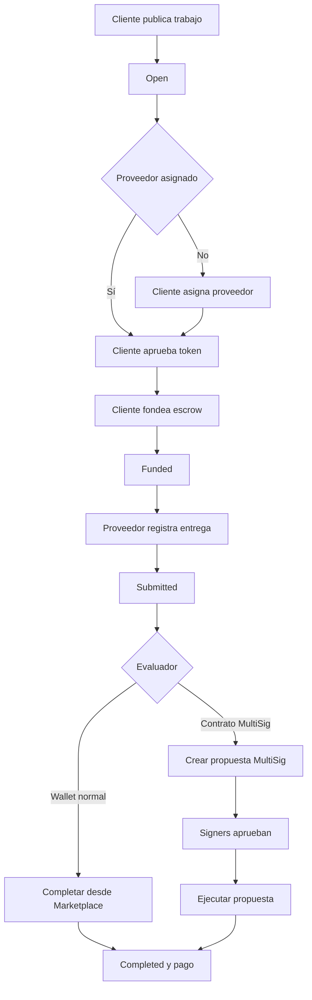

# Guía de uso y validación manual - Entrega 3

> Aplicación: Job Marketplace sobre Sepolia.
>
> Fuente de requisitos:
> `temp/LetrasProfes/Originales/Entrega Final - Job Marketplace.pdf`.
>
> Esta guía parte de que los contratos ya están desplegados y el frontend puede
> iniciarse. Incluye un recorrido corto para demostrar la aplicación y una
> validación completa requisito por requisito.

## 1. Qué se prueba

La aplicación tiene dos pestañas:

| Pestaña | Para qué sirve |
|---|---|
| `Marketplace` | Publicar, seleccionar y operar trabajos. |
| `Administración MultiSig` | Crear, aprobar, ejecutar y cancelar propuestas del evaluador MultiSig. |

El flujo principal es:



## 2. Conceptos que hay que entender antes de probar

### Cliente

Es la wallet que crea el trabajo y aporta los tokens del presupuesto.

Necesita:

- ETH de Sepolia para pagar gas;
- tokens ERC-20 para el presupuesto;
- aprobar al Marketplace antes de fondear.

### Proveedor

Es la wallet que realiza el trabajo y registra la entrega.

Necesita:

- ETH de Sepolia para pagar el gas de `submit`;
- no necesita tokens para recibir el pago;
- recibe los tokens cuando el evaluador completa el trabajo.

El proveedor puede definirse al publicar el trabajo o asignarse después.

### Evaluador EOA

Es una wallet normal configurada como evaluador. Puede completar o rechazar
directamente desde la pestaña `Marketplace`.

Este flujo es útil para probar rápidamente las acciones, pero no demuestra el
requisito de MultiSig como evaluador.

### Evaluador MultiSig

Es la dirección del contrato `MultiSig`, no una de las wallets signer.

Los signers no pueden presionar `Completar y pagar` directamente como si fueran
el evaluador. Deben:

1. generar una propuesta para `JobMarketplace.complete`;
2. aprobarla con las wallets signer;
3. alcanzar el threshold;
4. ejecutar la propuesta desde `Administración MultiSig`.

La llamada al Marketplace sale desde la dirección del contrato MultiSig. Por
eso el control `msg.sender == evaluator` se cumple.

### Cuenta externa

Es una wallet sin rol en el trabajo. Se usa para demostrar que
`claimRefund` puede ejecutarlo cualquiera después del vencimiento.

## 3. Preparación

El orden recomendado es:

```text
Instalar dependencias
-> compilar
-> ejecutar tests
-> preparar wallets y .env mínimo
-> desplegar MultiSig
-> desplegar Marketplace y token
-> completar direcciones en .env
-> iniciar frontend
```

### 3.1 Instalar dependencias

Desde la raíz:

```bash
npm install
```

Desde `frontend/`:

```bash
cd frontend
npm install
cd ..
```

### 3.2 Compilar y ejecutar tests

Desde la raíz:

```bash
npm run compile
npm test
```

Resultado de referencia:

```text
Nothing to compile
42 passing
```

No continuar con el deploy si la compilación o los tests fallan.

### 3.3 Preparar las wallets

Configuración recomendada:

| Alias | Uso | ETH Sepolia | Token |
|---|---|---:|---:|
| `CLIENTE` | Crear, aprobar, fondear y rechazar en `Open` | Sí | Sí |
| `PROVEEDOR` | Registrar entrega y recibir pago | Sí | No |
| `EVALUADOR` | Probar evaluación directa | Sí | No |
| `SIGNER_1` | Crear y aprobar propuesta MultiSig | Sí | No |
| `SIGNER_2` | Aprobar y ejecutar propuesta MultiSig | Sí | No |
| `EXTERNO` | Ejecutar refund sin tener rol | Sí | No |

Como mínimo, las cuentas que despliegan o envían transacciones necesitan ETH
de Sepolia para pagar gas.

Se pueden reutilizar wallets, pero usar cuentas distintas hace más clara la
demostración del access control.

Registrar las direcciones:

| Alias | Dirección |
|---|---|
| `CLIENTE` | |
| `PROVEEDOR` | |
| `EVALUADOR` | |
| `SIGNER_1` | |
| `SIGNER_2` | |
| `EXTERNO` | |

### 3.4 Crear el `.env` inicial

La aplicación y los scripts leen un único `.env` desde la raíz.

Crear el archivo desde `.env.example`.

Git Bash, Linux o macOS:

```bash
cp .env.example .env
```

PowerShell:

```powershell
Copy-Item .env.example .env
```

Windows CMD:

```cmd
copy .env.example .env
```

Antes del deploy solo hace falta completar:

```env
SEPOLIA_RPC_URL=https://ethereum-sepolia-rpc.publicnode.com

PRIVATE_KEY=clave_deployer_o_signer_1_sin_0x
PRIVATE_KEY_2=clave_signer_2_sin_0x

SIGNERS=0xDireccionSigner1,0xDireccionSigner2
THRESHOLD=2

VITE_WALLETCONNECT_PROJECT_ID=project_id_de_reown

# Dejar vacío para desplegar MockERC20.
PAYMENT_TOKEN_ADDRESS=

MOCK_TOKEN_INITIAL_SUPPLY=1000000
```

Las variables con direcciones de contratos todavía pueden quedar como
placeholders porque se obtienen en los siguientes deploys.

Reglas:

- las private keys van sin `0x`;
- `SIGNERS` contiene direcciones, no claves privadas;
- `THRESHOLD=2` requiere al menos dos signers;
- no subir `.env` a Git;
- no colocar claves privadas en variables `VITE_`;
- `VITE_WALLETCONNECT_PROJECT_ID` se obtiene desde Reown.

### 3.5 Desplegar el MultiSig

Desde la raíz:

```bash
npm run deploy:sepolia
```

El script imprime la dirección desplegada y esta variable:

```env
VITE_CONTRACT_ADDRESS=0x...
```

Copiar la misma dirección en ambas variables del `.env`:

```env
VITE_MULTISIG_ADDRESS=0xDireccionImprimida
VITE_CONTRACT_ADDRESS=0xDireccionImprimida
```

Deben ser iguales porque `VITE_CONTRACT_ADDRESS` es el alias legacy de
`VITE_MULTISIG_ADDRESS`.

Registrar:

| Dato | Valor |
|---|---|
| Dirección MultiSig | |
| Hash del deploy | |
| Link Etherscan | |
| Signers | |
| Threshold | |

### 3.6 Desplegar el token y el Marketplace

Existen dos opciones.

#### Opción A: desplegar `MockERC20`

Dejar:

```env
PAYMENT_TOKEN_ADDRESS=
```

El script desplegará `MockERC20`, minteará tokens al deployer y luego desplegará
el Marketplace usando ese token.

#### Opción B: utilizar un ERC-20 existente

Configurar antes del deploy:

```env
PAYMENT_TOKEN_ADDRESS=0xDireccionDelTokenExistente
```

Después ejecutar:

```bash
npm run deploy:marketplace:sepolia
```

El script imprime:

```env
PAYMENT_TOKEN_ADDRESS=0x...
VITE_MARKETPLACE_ADDRESS=0x...
VITE_MARKETPLACE_DEPLOYMENT_BLOCK=12345678
VITE_PAYMENT_TOKEN_ADDRESS=0x...
```

Copiar los cuatro valores al `.env`.

`VITE_MARKETPLACE_DEPLOYMENT_BLOCK` debe ser exactamente el bloque impreso por
este deploy. No usar el bloque del token ni el bloque del MultiSig.

Si se desplegó `MockERC20`, el mint inicial fue enviado al deployer. La forma
más sencilla de probar es usar el deployer como `CLIENTE`.

Registrar:

| Dato | Valor |
|---|---|
| Dirección PaymentToken | |
| Dirección Marketplace | |
| Bloque de deploy Marketplace | |
| Hash deploy token, si corresponde | |
| Hash deploy Marketplace | |
| Links Etherscan | |

### 3.7 Comprobar el `.env` final

Después de ambos deploys deben existir valores reales:

```env
VITE_WALLETCONNECT_PROJECT_ID=...
VITE_MULTISIG_ADDRESS=0x...
VITE_CONTRACT_ADDRESS=0x...
VITE_MARKETPLACE_ADDRESS=0x...
VITE_MARKETPLACE_DEPLOYMENT_BLOCK=...
VITE_PAYMENT_TOKEN_ADDRESS=0x...
```

Reglas:

- `VITE_MULTISIG_ADDRESS` y `VITE_CONTRACT_ADDRESS` deben ser iguales.
- `PAYMENT_TOKEN_ADDRESS` y `VITE_PAYMENT_TOKEN_ADDRESS` deben identificar el mismo token.
- `VITE_MARKETPLACE_DEPLOYMENT_BLOCK` debe ser el bloque exacto del deploy del Marketplace.
- No usar el bloque del token ni el bloque del MultiSig.
- Las direcciones no deben conservar textos como `0xDireccionDel...`.
- No iniciar Vite antes de completar estas variables.

### 3.8 Iniciar el frontend

En otra terminal:

```bash
cd frontend
npm run dev
```

Abrir la URL mostrada por Vite, normalmente:

```text
http://localhost:5173
```

No cambiar entre `localhost` y `127.0.0.1` durante las pruebas del entregable:
`localStorage` depende del origen del navegador.

Si se modifica el `.env` después de este punto, detener y volver a iniciar
`npm run dev`.

## 4. Cómo conectar y cambiar wallets

### Conectar por primera vez

1. Abrir la aplicación.
2. Buscar `Conectar Wallet` arriba a la derecha.
3. Presionarlo.
4. Elegir MetaMask en el modal de RainbowKit.
5. Autorizar la conexión.
6. Si aparece `Red incorrecta`, presionarlo.
7. Elegir Sepolia.
8. Confirmar que el encabezado muestra la cuenta abreviada.

En la pestaña `Marketplace`, la etiqueta de la cuenta dice `Marketplace`.

En `Administración MultiSig`, la etiqueta dice:

- `Signer` si la cuenta pertenece al contrato;
- `No signer` si solo puede consultar.

### Cambiar de wallet

1. Presionar la cuenta abreviada arriba a la derecha.
2. Abrir MetaMask y seleccionar la cuenta requerida.
3. Si RainbowKit no refleja el cambio, desconectar desde su modal.
4. Volver a presionar `Conectar Wallet`.
5. Elegir la cuenta nueva.
6. Confirmar la dirección antes de ejecutar una acción.

No hace falta recargar la página. Los roles y permisos deben cambiar
automáticamente.

### Cambiar de pestaña

Usar los botones del encabezado:

```text
Marketplace | Administración MultiSig
```

Cambiar de pestaña no cambia la wallet conectada.

## 5. Reconocer la pantalla Marketplace

La columna izquierda contiene:

1. `Publicar trabajo`;
2. `Trabajos publicados`;
3. filtros por estado.

La columna derecha contiene:

1. `Marketplace`, con direcciones, balance y allowance;
2. `Detalle del trabajo`;
3. panel de acciones según rol y estado;
4. `MultiSig evaluator`, para construir propuestas.

Para operar un job primero hay que seleccionarlo en `Trabajos publicados`.

Estados visibles:

| UI | Estado del contrato |
|---|---|
| `Abierto` | `Open` |
| `Fondeado` | `Funded` |
| `Entregado` | `Submitted` |
| `Completado` | `Completed` |
| `Rechazado` | `Rejected` |
| `Expirado` | `Expired` |

## 6. Datos de prueba recomendados

### Happy path con MultiSig

| Campo | Valor |
|---|---|
| Descripción | `QA-MULTISIG-HAPPY-001` |
| Presupuesto | `10` |
| Evaluador | usar botón `Usar MultiSig` |
| Proveedor | dirección de `PROVEEDOR` |
| Vencimiento | al menos 24 horas en el futuro |
| Entrega | `Entrega QA v1 - https://example.com/entrega` |
| Razón | `approved` |

### Razones

Los motivos se guardan en `bytes32`, por lo que deben ocupar 31 bytes o menos.

Usar:

```text
approved
rejected
cancelled
```

## 7. Recorrido corto para demostrar la aplicación

Este es el flujo recomendado para una demostración principal.

### Paso 1: conectar el cliente

1. Ir a `Marketplace`.
2. Conectar `CLIENTE`.
3. Confirmar Sepolia.
4. Revisar el panel `Marketplace`.
5. Confirmar que muestra balance y allowance del token.

Resultado esperado:

- wallet conectada;
- red correcta;
- datos reales;
- no aparecen valores simulados.

### Paso 2: publicar un trabajo con evaluador MultiSig

1. Permanecer en `Marketplace`.
2. Ir a `Publicar trabajo`.
3. Escribir `QA-MULTISIG-HAPPY-001`.
4. Escribir presupuesto `10`.
5. Presionar `Usar MultiSig`.
6. Pegar `PROVEEDOR` en `Proveedor opcional`.
7. Elegir un vencimiento futuro.
8. Presionar `Publicar trabajo`.
9. Confirmar MetaMask.
10. Esperar el toast de éxito.
11. Buscar el job nuevo en `Trabajos publicados`.
12. Seleccionarlo.

Resultado esperado:

- aparece sin recargar;
- estado `Abierto`;
- evaluador igual a la dirección del MultiSig;
- proveedor igual a `PROVEEDOR`.

### Paso 3: aprobar token

1. Mantener conectado `CLIENTE`.
2. Mantener seleccionado el job.
3. En el panel de acciones presionar `Aprobar token`.
4. Confirmar MetaMask.
5. Esperar el receipt.

Resultado esperado:

- aparece `Tx pendiente…`;
- allowance pasa a cubrir el presupuesto;
- el botón cambia a `Fondear escrow`.

### Paso 4: fondear el escrow

1. Presionar `Fondear escrow`.
2. Confirmar MetaMask.
3. Esperar el receipt.

Resultado esperado:

- estado `Fondeado`;
- el Marketplace custodia 10 tokens;
- el cliente pierde 10 tokens de su balance;
- la tarjeta se actualiza sin reload.

### Paso 5: registrar entrega como proveedor

1. Cambiar la wallet a `PROVEEDOR`.
2. Permanecer en `Marketplace`.
3. Seleccionar el mismo job.
4. Confirmar que aparece `Contenido o URL de la entrega`.
5. Escribir:

```text
Entrega QA v1
Resultado disponible en https://example.com/entrega
```

6. Presionar `Registrar entrega`.
7. Confirmar MetaMask.
8. Esperar el receipt.

Resultado esperado:

- estado `Entregado`;
- aparece una referencia hash;
- el contenido continúa visible en `Detalle del trabajo`;
- el contenido queda guardado en el navegador;
- en blockchain solo queda el hash.

### Paso 6: generar la propuesta MultiSig

1. Cambiar a `SIGNER_1`.
2. Volver a seleccionar el job `Entregado`.
3. Bajar hasta `MultiSig evaluator`.
4. Confirmar que `jobId` coincide con el trabajo.
5. Escribir `approved` en `reason`.
6. Confirmar que aparece un calldata.
7. Presionar `Crear propuesta MultiSig`.

La aplicación cambia automáticamente a `Administración MultiSig`.

Resultado esperado:

- `Dirección Destino` contiene el Marketplace;
- `Valor en ETH` contiene `0`;
- `Calldata` está precargado;
- aparece una advertencia indicando `JobMarketplace.complete`;
- la cuenta aparece como `Signer`.

### Paso 7: enviar y aprobar con signer 1

1. Revisar destino, valor y calldata.
2. Presionar `Enviar Propuesta`.
3. Confirmar MetaMask.
4. Esperar a que aparezca la propuesta.
5. Confirmar que se muestra:

```text
Acción Marketplace
Completar trabajo #N
Razón: approved
```

6. Presionar `Aprobar`.
7. Confirmar MetaMask.

Resultado esperado:

- propuesta `Pendiente`;
- aprobaciones `1 / 2`, si el threshold es 2;
- el botón cambia a `Ya aprobado`.

Crear la propuesta no la aprueba automáticamente.

### Paso 8: aprobar con signer 2

1. Cambiar la wallet a `SIGNER_2`.
2. Permanecer en `Administración MultiSig`.
3. Confirmar la etiqueta `Signer`.
4. Buscar la misma propuesta.
5. Presionar `Aprobar`.
6. Confirmar MetaMask.

Resultado esperado:

- aprobaciones `2 / 2`;
- aparece habilitada la acción `Ejecutar`.

### Paso 9: ejecutar

1. Presionar `Ejecutar`.
2. Confirmar MetaMask.
3. Esperar el receipt.
4. Confirmar que la propuesta queda `Ejecutada`.
5. Presionar `Volver al Marketplace`.

Resultado esperado:

- el job sigue seleccionado;
- estado `Completado`;
- razón `approved`;
- el proveedor recibió 10 tokens;
- no quedan acciones disponibles sobre el job finalizado.

## 8. Flujo alternativo: proveedor asignado después

Este flujo prueba `setProvider`.

### Crear sin proveedor

1. Conectar `CLIENTE`.
2. Ir a `Marketplace`.
3. Publicar un job.
4. Dejar `Proveedor opcional` vacío.
5. Usar cualquier evaluador válido.
6. Confirmar la transacción.
7. Seleccionar el job.

### Asignar proveedor

1. Buscar `Dirección del proveedor`.
2. Pegar `PROVEEDOR`.
3. Presionar `Asignar proveedor`.
4. Confirmar MetaMask.

Resultado esperado:

- proveedor actualizado sin reload;
- desaparece `Asignar proveedor`;
- aparece `Aprobar token`;
- otra wallet no puede ver esa acción.

Prueba negativa:

1. Introducir una dirección inválida.
2. Confirmar que MetaMask no se abre.
3. Introducir la dirección cero.
4. Confirmar que la UI la rechaza.

## 9. Flujo alternativo: rechazo del cliente en Open

1. Conectar `CLIENTE`.
2. Crear un job nuevo.
3. No aprobar ni fondear.
4. Seleccionarlo en estado `Abierto`.
5. Escribir `cancelled` en `Motivo del rechazo`.
6. Presionar `Rechazar trabajo`.
7. Confirmar MetaMask.

Resultado esperado:

- estado `Rechazado`;
- acción irreversible;
- no se mueven tokens;
- `resultReason` registra el motivo;
- otra wallet no ve el botón.

Prueba negativa:

1. Usar un motivo de más de 31 bytes.
2. Confirmar que la UI muestra error antes de abrir MetaMask.

## 10. Flujo alternativo: rechazo del evaluador en Funded

1. Crear un job con `EVALUADOR` como evaluador.
2. Aprobar y fondear como `CLIENTE`.
3. Registrar el balance del cliente después del fondeo.
4. Cambiar a `EVALUADOR`.
5. Seleccionar el job `Fondeado`.
6. Escribir `rejected`.
7. Presionar `Rechazar`.
8. Confirmar MetaMask.

Resultado esperado:

- estado `Rechazado`;
- los tokens vuelven al cliente;
- el proveedor no recibe tokens;
- el trabajo no puede entregarse.

## 11. Flujo alternativo: rechazo del evaluador en Submitted

1. Crear y fondear un job con `EVALUADOR`.
2. Registrar entrega como `PROVEEDOR`.
3. Cambiar a `EVALUADOR`.
4. Seleccionar el job `Entregado`.
5. Escribir `rejected`.
6. Presionar `Rechazar`.
7. Confirmar MetaMask.

Resultado esperado:

- estado `Rechazado`;
- tokens reembolsados al cliente;
- hash de entrega conservado;
- contenido local todavía visible en el mismo navegador.

## 12. Flujo alternativo: complete con evaluador EOA

Este flujo evita MultiSig y sirve para aislar la lógica de `complete`.

1. Crear un job usando `EVALUADOR`, no `Usar MultiSig`.
2. Fondear como `CLIENTE`.
3. Registrar entrega como `PROVEEDOR`.
4. Cambiar a `EVALUADOR`.
5. Seleccionar el job `Entregado`.
6. Escribir `approved`.
7. Presionar `Completar y pagar`.
8. Confirmar MetaMask.

Resultado esperado:

- estado `Completado`;
- proveedor recibe el presupuesto;
- cliente ya no puede recuperar esos tokens;
- una wallet distinta no ve `Completar y pagar`.

## 13. Refund desde Funded

Para evitar una espera larga, crear el job con vencimiento entre 5 y 10 minutos
en el futuro.

1. Crear el job como `CLIENTE`.
2. Aprobar y fondear.
3. No registrar entrega.
4. Antes del vencimiento, confirmar que no aparece `Reclamar reembolso`.
5. Esperar hasta que la hora del bloque sea posterior al vencimiento.
6. Cambiar a `EXTERNO`.
7. Seleccionar el job.
8. Presionar `Reclamar reembolso`.
9. Confirmar MetaMask.

Resultado esperado:

- estado `Expirado`;
- tokens devueltos al cliente;
- `EXTERNO` solo paga gas y no recibe tokens;
- la acción funciona aunque `EXTERNO` no tenga rol.

## 14. Refund desde Submitted

1. Crear un job con vencimiento corto.
2. Aprobar y fondear como `CLIENTE`.
3. Registrar entrega como `PROVEEDOR` antes del vencimiento.
4. Esperar el vencimiento.
5. Cambiar a `EXTERNO`.
6. Presionar `Reclamar reembolso`.

Resultado esperado:

- estado `Expirado`;
- tokens devueltos al cliente;
- hash y contenido local de la entrega conservados;
- el trabajo ya no puede completarse ni rechazarse.

## 15. Validar el almacenamiento off-chain

### Mismo navegador

1. Registrar una entrega.
2. Confirmar el job en estado `Entregado`.
3. Revisar `Detalle del trabajo`.
4. Confirmar que muestra contenido, proveedor y fecha.
5. Recargar la página.
6. Seleccionar nuevamente el job.

Resultado esperado:

- el contenido continúa disponible;
- el hash on-chain no cambió;
- el registro local aparece confirmado.

### Cambio de wallet

1. En el mismo navegador, cambiar de `PROVEEDOR` a un signer o evaluador.
2. Seleccionar el mismo job.

Resultado esperado:

- el contenido sigue visible porque depende del navegador, no de la wallet.

### Otro navegador u origen

1. Abrir la app en otro navegador o con otro origen.
2. Seleccionar el mismo job.

Resultado esperado:

```text
La entrega existe on-chain, pero su contenido no está disponible
en este navegador.
```

Esto es una limitación deliberada de `localStorage`, no una pérdida del hash
on-chain.

## 16. Validar que el tablero usa `JobCreated`

La letra exige descubrir trabajos leyendo eventos `JobCreated`.

### Jobs históricos

1. Abrir el Marketplace en Etherscan.
2. Revisar los eventos `JobCreated`.
3. Registrar los IDs emitidos desde el bloque de deploy.
4. Abrir la aplicación.
5. Seleccionar el filtro `Todos`.
6. Comparar los IDs con las tarjetas.

Resultado esperado:

- todos los IDs históricos aparecen;
- no aparecen IDs inexistentes;
- las tarjetas muestran el estado actual, no solo el estado inicial del evento.

### Job nuevo

1. Publicar un job.
2. Esperar el receipt.
3. No recargar.

Resultado esperado:

- el nuevo ID aparece automáticamente;
- el evento `JobCreated` está visible en Etherscan;
- el ID de la tarjeta coincide con el evento.

### Cambio de estado

1. Fondear, entregar o rechazar un job ya existente.
2. Mantener la misma tarjeta seleccionada.

Resultado esperado:

- el ID no cambia;
- el estado sí cambia;
- no hace falta un nuevo `JobCreated`;
- `getJob(jobId)` aporta el estado actualizado.

## 17. Pruebas de permisos

Usar una wallet incorrecta en cada estado.

| Estado | Cuenta incorrecta | Acción que no debe aparecer o debe revertir |
|---|---|---|
| `Open` sin proveedor | No cliente | `Asignar proveedor` |
| `Open` | No cliente | `Aprobar token`, `Fondear escrow`, `Rechazar trabajo` |
| `Funded` | No proveedor | `Registrar entrega` |
| `Funded` | No evaluador | `Rechazar` |
| `Submitted` | No evaluador | `Completar y pagar`, `Rechazar` |
| MultiSig | No signer | Proponer, aprobar, ejecutar o cancelar |

La UI puede ocultar acciones inválidas. Además, el contrato debe seguir
rechazándolas si se intenta operar por otro medio.

## 18. Pending, errores y actualización

En cada transacción comprobar:

1. el botón queda deshabilitado;
2. aparece spinner o `Tx pendiente…`;
3. rechazar la firma en MetaMask limpia el pending;
4. el formulario conserva los datos cuando corresponde;
5. un receipt correcto actualiza la UI sin recargar;
6. el toast explica el resultado;
7. un revert muestra un mensaje comprensible.

Casos de error útiles:

| Prueba | Resultado esperado |
|---|---|
| Budget `0` | Error local. |
| Vencimiento pasado | Error local. |
| Dirección inválida | Error local. |
| Reason mayor a 31 bytes | Error local. |
| Fondear sin allowance | No debe habilitarse aún. |
| Fondear sin proveedor | Debe pedir asignarlo. |
| Completar un job no `Submitted` | Advertencia o revert claro. |
| Ejecutar propuesta sin threshold | Botón deshabilitado o revert. |
| Aprobar dos veces | `Ya aprobado` o revert claro. |

## 19. Evidencia que conviene guardar

Por cada flujo principal:

| Evidencia | Valor |
|---|---|
| `jobId` | |
| Wallet cliente | |
| Wallet proveedor | |
| Evaluador o MultiSig | |
| Hash `createJob` | |
| Hash `approve` | |
| Hash `fund` | |
| Hash `submit` | |
| ID propuesta MultiSig | |
| Hash `execute` o acción final | |
| Estado final | |
| Balance cliente antes/después | |
| Balance proveedor antes/después | |
| Captura UI | |
| Enlace Etherscan | |
| Observaciones | |

## 20. Checklist de requisitos

### Contratos y tests

- [ ] `npm run compile` pasa.
- [ ] `npm test` informa `42 passing`.
- [ ] Happy path completo.
- [ ] Rechazo en `Open`.
- [ ] Rechazo en `Funded`.
- [ ] Rechazo en `Submitted`.
- [ ] Refund desde `Funded`.
- [ ] Refund desde `Submitted`.
- [ ] Access control.
- [ ] MultiSig real como evaluador.

### Frontend

- [ ] RainbowKit conecta MetaMask.
- [ ] La red activa es Sepolia.
- [ ] Cambiar cuenta actualiza roles.
- [ ] El tablero recupera eventos `JobCreated`.
- [ ] Jobs históricos visibles.
- [ ] Job nuevo visible sin reload.
- [ ] Detalle completo.
- [ ] Publicación de trabajo.
- [ ] Proveedor opcional.
- [ ] `setProvider`.
- [ ] `approve`.
- [ ] `fund`.
- [ ] `submit`.
- [ ] `complete`.
- [ ] `reject`.
- [ ] `claimRefund`.
- [ ] Pending visible.
- [ ] Errores claros.
- [ ] Sin datos simulados.

### Deliverable

- [ ] Contenido guardado en `localStorage`.
- [ ] Solo hash guardado on-chain.
- [ ] Persistencia después de recargar.
- [ ] Visible al cambiar wallet en el mismo navegador.
- [ ] Advertencia correcta desde otro navegador.

### MultiSig

- [ ] Job usa la dirección del MultiSig como evaluador.
- [ ] Helper genera calldata.
- [ ] Formulario aparece precargado.
- [ ] Signer 1 crea propuesta.
- [ ] Signer 1 aprueba.
- [ ] Signer 2 aprueba.
- [ ] Se alcanza threshold.
- [ ] La propuesta se ejecuta.
- [ ] El job queda `Completed`.
- [ ] El proveedor recibe tokens.

### Documentación y entrega

- [ ] README contiene direcciones Sepolia reales.
- [ ] README contiene bloque de deploy.
- [ ] Enlaces Etherscan funcionan.
- [ ] `.env` no está trackeado.
- [ ] Los cambios finales están commiteados.
- [ ] El commit está publicado en GitHub.

## 21. Diagnóstico rápido de problemas

### No aparece ningún trabajo

Comprobar:

1. `VITE_MARKETPLACE_ADDRESS`;
2. `VITE_MARKETPLACE_DEPLOYMENT_BLOCK`;
3. red Sepolia;
4. RPC;
5. eventos `JobCreated` en Etherscan;
6. reinicio de Vite después de cambiar `.env`.

### El botón MultiSig está deshabilitado

Falta `VITE_MULTISIG_ADDRESS` o contiene una dirección inválida.

### La pestaña MultiSig dice `No signer`

La wallet conectada no pertenece al array de signers del contrato desplegado.
Cambiar a `SIGNER_1` o `SIGNER_2`.

### El signer no puede completar directamente

Es correcto. El evaluador es el contrato MultiSig. Usar:

```text
Marketplace
-> MultiSig evaluator
-> Crear propuesta MultiSig
-> Administración MultiSig
-> Aprobar
-> Ejecutar
```

### No aparece `Aprobar token`

Posibles causas:

- no está conectado el cliente;
- falta proveedor;
- el job no está `Open`;
- el allowance ya es suficiente y aparece `Fondear escrow`.

### El proveedor no puede registrar entrega

Comprobar:

- wallet igual a `job.provider`;
- job en `Funded`;
- job no vencido;
- ETH Sepolia disponible.

### La entrega no aparece en otro navegador

Es el comportamiento esperado de `localStorage`. El hash sigue on-chain, pero
el contenido completo solo existe en el navegador y origen donde fue guardado.

### La propuesta MultiSig revierte al ejecutar

Comprobar:

1. job en `Submitted`;
2. evaluator del job igual al contrato MultiSig;
3. destino igual al Marketplace;
4. valor igual a `0`;
5. calldata correspondiente al job correcto;
6. propuesta no ejecutada ni cancelada;
7. threshold alcanzado.

## 22. Resultado final de la validación

Completar después de ejecutar la guía:

| Área | Estado | Observaciones |
|---|---|---|
| Contratos | `PENDIENTE` | |
| Tests | `PENDIENTE` | |
| RainbowKit y Sepolia | `PENDIENTE` | |
| Tablero desde eventos | `PENDIENTE` | |
| Happy path EOA | `PENDIENTE` | |
| Happy path MultiSig | `PENDIENTE` | |
| Rechazos | `PENDIENTE` | |
| Refunds | `PENDIENTE` | |
| Deliverable off-chain | `PENDIENTE` | |
| README y direcciones | `PENDIENTE` | |
| GitHub actualizado | `PENDIENTE` | |

Juicio de entrega:

```text
[ ] LISTO PARA ENTREGAR
[ ] LISTO CON OBSERVACIONES
[ ] NO LISTO
```

Observaciones finales:

```text

```
